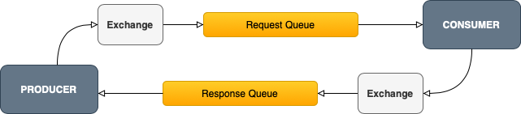
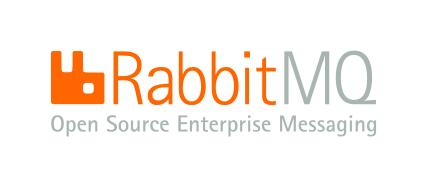

=======
 guirpc
=======
| Is a **Python** RPC package to build and run FaaS-like application service.
| It facilitates the creation of an consumer or a producer, as well as an abstraction layer for the transmission
  of messages over a connected message broker server.

.. rst-class:: title-note

  updated at January 28, 2021

About RPC
=========
**RPC (Remote Procedure Call**) technically is described as a transport protocol
and stands for a common pattern of communication between applications acting as a client/server pairs.
However it is better thought as a general mechanism closely linked to distributed systems because it meets
the needs of an application that requires an exchange of request / response messages.

This pattern is implemented through a transport layer, usually referred as a **message broker server**, like `RabbitMQ`_.

.. _RabbitMQ: https://www.rabbitmq.com

Simple Request-Reply (RPC) pattern
----------------------------------
There are different patterns in the RPC mechanism but focusing on the Simple RPC, the message transaction
is performed in the following way:

A ``client/producer`` sends a request message that is routed to a long-lived server queue.
The message is consumed by the ``server/consumer`` from the request queue and then
it sends back a response through a response queue to the client.

*The client is blocked until a response is received from the server.*

|

About this package
==================
This package implements core functionality that is compliant with the standard **AMQP**.
It provides an interface with some decorators, encoders, serializers and in short all the surrounded layers for easily build,
configure and run an **RPC server** as it makes up as a **FaaS-like application**.

It also provides a command line manager to handle operations that will essentially allow to setup
and run a configured RPC server/consumer that will respond on messages received
trough **RabbitMQ** back to a connected client/producer.

Transport layers
----------------

.. note:: **RabbitMQ** is the unique supported message broker as transport layer in this project (for now).

**Index**: Documentation
========================

.. toctree::
   :maxdepth: 2

   quickstart

**Release:** Development history
================================

.. toctree::
   :maxdepth: 1
